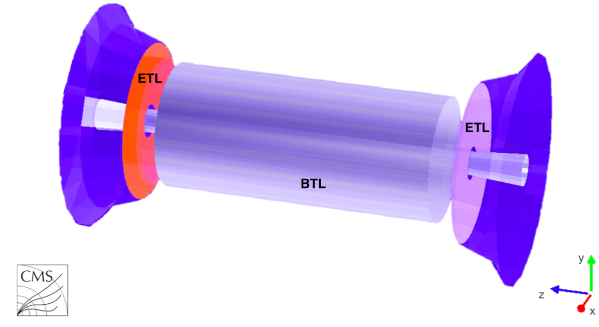

# CERN Summer Student Programme Project  

## Project Title  
**Analysis and Data Processing for the MTD BTL Detector at HL-LHC**  

## Supervisors  
- Mehmet Ozgur Sahin  
- Flavia Cetorelli  

</img>

---

## Project Overview  
This project focuses on the **MIP Timing Detector (MTD)** for the **High-Luminosity Large Hadron Collider (HL-LHC)**. The MTD introduces precise timing measurements to improve vertex reconstruction, critical for disentangling pile-up interactions in high-luminosity conditions.  

**Note on Code/Data**:  
*Due to privacy and confidentiality policies at CERN, the code and data for this project cannot be made publicly available. However, the project methodology, key findings, and technical details are presented in the accompanying presentation slides.*  

---

## Key Components  
### 1. **MTD BTL Detector**  
- Uses **LYSO scintillator crystals**, **SiPMs**, and **TOFHIR readout chips**.  
- Structured in azimuthal segments (10° each) with 6 readout units per segment.  

### 2. **TOFHIR Chip**  
- Radiation-tolerant ASIC for signal processing.  
- Features **TDC (timing)**, **QDC (charge)**, and **CFD (timing precision)**.  

### 3. **Analysis Goals**  
- Study MIP interactions with LYSO crystals (Landau-distributed spectra).  
- Process TOFHIR data for time/charge measurements.  

---

## Tools & Technologies  
- **Python** with `numpy`, `matplotlib`, and `uproot`.  
- **Jupyter SWAN** (CERN's analysis platform).  

---

## Project Documentation  
All technical details, methodologies, and results are documented in the presentation slides:  
- **Presentation.pptx** (included in this repository).  

---

## Acknowledgments  
Special thanks to my supervisors and the **CERN Summer Student Programme 2023** for this opportunity.  
 

---  
*This project was conducted as part of the **CERN Summer Student Programme 2023**. Code and data are restricted under CERN policies.*  
